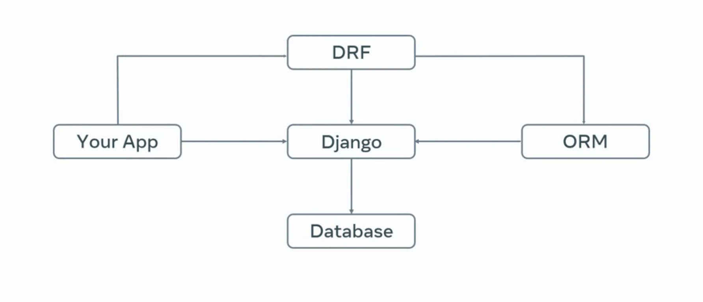
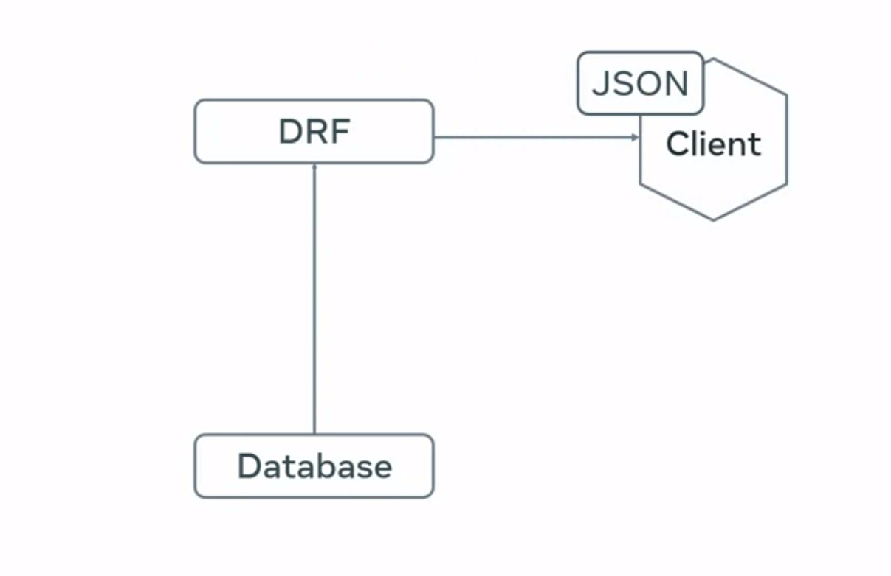
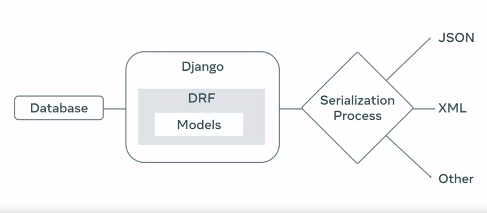
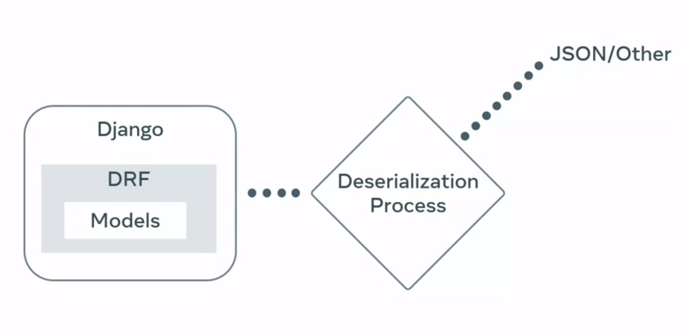

# Django Backend Development-Django Rest Framework (DRF).


## Django Rest Framework (DRF) Overview

Django Rest Framework (DRF) is an essential toolkit built on top of the Django web framework, designed to simplify and expedite the development of robust APIs. This section introduces DRF, highlighting its benefits and why it’s preferred over using plain Django for API development.



### Why Use Django Rest Framework?

### Key Benefits

1. **Efficient Serialization:**

   - **Serialization:** DRF excels at converting complex data types, such as Django models, into JSON, XML, or other content types, making it easy to interact with client applications.
  
     
   - **Deserialization:** It also supports the reverse process, validating and converting incoming data back into complex types.
  
      

2. **Integration with Django:**
   - DRF integrates seamlessly with existing Django projects, requiring minimal configuration changes to get started.

3. **Browsable API:**
   - DRF includes a browsable API interface, allowing developers to interact with the API using different HTTP methods directly from the browser without needing external tools like Postman or Insomnia.

4. **Enhanced Request and Response Handling:**
   - DRF's custom request and response objects extend Django's default ones, providing more flexibility in processing data.

5. **Human-Readable Status Codes:**
   - The `status` module in DRF provides human-readable HTTP status codes, enhancing code readability and maintainability. For example, `status.HTTP_200_OK` instead of `200`.

6. **Built-In Viewsets and Routers:**
   - DRF simplifies CRUD operations with built-in viewset classes and routers, allowing for quick setup and customization as needed.

7. **Comprehensive Authentication and Permissions:**
   - DRF offers extensive support for various authentication protocols (e.g., token-based authentication, OAuth) and permissions, facilitating the implementation of secure APIs.

8. **Flexibility and Extensibility:**
   - DRF is highly customizable and can handle data conversion for non-ORM objects as well, saving development time and effort.

Certainly! Here's the provided guide reformatted into a README format with proper indentation and formatting:

---

## Setting up Django Rest Framework (DRF) with Pipenv

### Why Pipenv?

Pipenv combines the functionalities of `pip` and `virtualenv`, providing a streamlined way to manage project dependencies and environments in Python, especially for Django projects using DRF.

### Project Setup

### 1. Create a Project Directory

```sh
mkdir BookList
```

### 2. Navigate to Project Directory

```sh
cd BookList
```

### 3. Install Django and Django Rest Framework Using Pipenv

```sh
pipenv install django
pipenv install djangorestframework
```

### 4. Activate the Virtual Environment

```sh
pipenv shell
```

### 5. Create the Django Project

```sh
django-admin startproject BookList .
```

### 6. Create a Django App

```sh
python manage.py startapp BookListApi
```

### 7. Configure Settings

Open `BookList/settings.py` and add DRF and your app to `INSTALLED_APPS`:

```python
INSTALLED_APPS = [
    'django.contrib.admin',
    'django.contrib.auth',
    'django.contrib.contenttypes',
    'django.contrib.sessions',
    'django.contrib.messages',
    'django.contrib.staticfiles',
    'rest_framework',          # Add DRF here
    'BookListApi',             # Add your app here
]
```

## Creating the API

### Step 1: Define the Model

#### `BookListApi/models.py`

Define a `Book` model:

```python
from django.db import models

class Book(models.Model):
    title = models.CharField(max_length=100)
    author = models.CharField(max_length=100)
    published_date = models.DateField()
    isbn = models.CharField(max_length=13)
    pages = models.IntegerField()
    cover = models.URLField()
    language = models.CharField(max_length=30)

    def __str__(self):
        return self.title
```

### Step 2: Create the Serializer

#### `BookListApi/serializers.py`

Create a serializer for the `Book` model:

```python
from rest_framework import serializers
from .models import Book

class BookSerializer(serializers.ModelSerializer):
    class Meta:
        model = Book
        fields = '__all__'
```

### Step 3: Define Views

#### `BookListApi/views.py`

Create a view set for the `Book` model:

```python
from rest_framework import viewsets
from .models import Book
from .serializers import BookSerializer

class BookViewSet(viewsets.ModelViewSet):
    queryset = Book.objects.all()
    serializer_class = BookSerializer
```

### Step 4: Configure URLs

#### `BookListApi/urls.py`

Create a router and register the `BookViewSet`:

```python
from django.urls import path, include
from rest_framework.routers import DefaultRouter
from .views import BookViewSet

router = DefaultRouter()
router.register(r'books', BookViewSet)

urlpatterns = [
    path('', include(router.urls)),
]
```

#### `BookList/urls.py`

Include the app URLs:

```python
from django.contrib import admin
from django.urls import path, include

urlpatterns = [
    path('admin/', admin.site.urls),
    path('api/', include('BookListApi.urls')),
]
```

### Step 5: Apply Migrations

Run the following commands to apply migrations and create a superuser:

```sh
python manage.py makemigrations
python manage.py migrate
```

### Step 6: Start the Development Server

Finally, start the development server:

```sh
python manage.py runserver
```

## Accessing the API

You can access the API at `http://127.0.0.1:8000/api/books/`.

---

## To Learn in Details

- [Routing](/routing.md)<br>
- [ViewSets](/viewsets.md)<br>
- [GenericBasedView](/genericview.md)<br>
- [Serializers](/serializers.md)<br>
- [Deserialization and Validation](/deserialization_validation.md)<br>
- [Filtering, Searching and Ordering](/fso.md)<br>
- [Data Sanitization](/datasanitization.md)<br>
- [Caching](/caching.md)<br>
- [Authentication](/authentication.md)<br>

